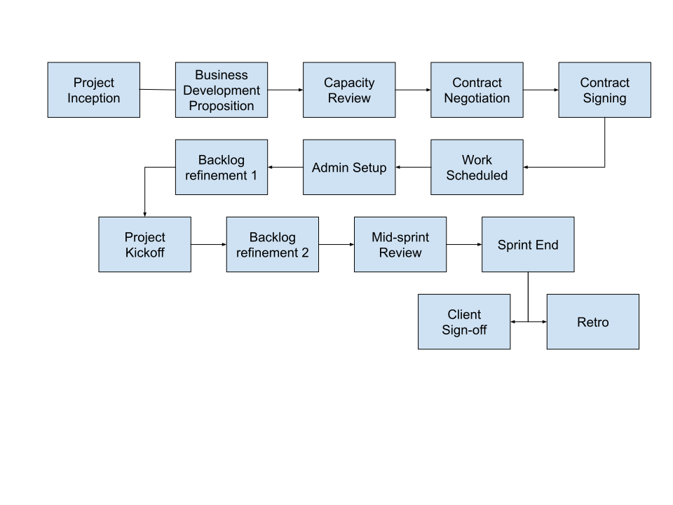

# Project Pipeline

This document is intended to outline an approach that can be adapted on a per project basis. The most useful elements of the process will be documented here.

## Generic Project Timeline (WIP)

This is an approximate timeline for projects at ODSC. Projects may vary in the order and specific steps that may be taken to reach the conclusion of the project, and some steps may repeat.

### Project Inception

This is the first contact with the client and formative discussions.

### Business Development Proposition

The prospect is then taken to Business Development who will raise relevant tickets for review. This is the point at which relevant roles might be filled by interested parties within the coop. These roles might approximately relate to Product Owner, Project Steward, Project Manager, as well as analysts and developers. These roles might overlap (on individuals) or not be required on a per project basis. E.g. a product owner or project manager might also be the project steward. Or an individual might be all three on a small project.

### Capacity Review

Ensure that the coop has capacity to do the work within the required timescales. This might mean speaking to people involved in the project and speaking to the dev scheduler/reviewing the dev focus spreadsheet.

### Contract Negotiation

This is the where the high level objectives and administration of the project will be defined.

### Contract signing

Both parties commit to the work.

### Work Scheduled

If not already done so, analysts will block out time for the project and the dev scheduler will update the dev focus spreadsheet.

### Admin setup

This is the creation of the relevant tools and planners for tracking the work, such as timekeeping, agile boards, CRMs, instant messaging channels, plan.io projects, etc.

### Backlog refinement 1

The first round of backlog refinement is the initial creation of tickets in the relevant work tracker (e.g. Trello, Plan.io, Jira, etc). The board is likely to include columns such as:

* Board constants
* Ideas and reports
* Ready
* In Progress
* Done

This might also include methods for highlighting, filtering, and linking tickets. These might be tickets that relate to a specific objective, tickets that are blocked, or tickets that have other conditions.

Ideally this first round of ticket creation would precede the Project Kickoff meeting, and involve the product owner, project manager, lead analyst, lead developer/technical architect.

### [Project Kickoff](project-kickoff.md) (Sprint Start)

This meeting is an opportunity for all stakeholders to meet, get an overview of the project, and define the work that is to be done over the course of the project. This is defined further in [Project Kickoff](project-kickoff.md).

### Backlog Refinement 2

Following, and in response to, the [Project Kickoff](project-kickoff.md) meeting it is useful to provide a delay to allow each person to review the overall project, their work, and respond with any requirements, timescales, and concerns. This meeting is an opportunity for this to happen. This meeting also provides an opportunity to define milestones and review the sequence of work where necessary.

### Mid-sprint review

This is an opportunity to review the work that has been completed and the work remaining. This will ensure that everyone has ample opportunity to adjust timescales and expectations or tie off loose ends before the end of the sprint.

### Sprint end

At this point all work for a given sprint should be completed. The sprint process may repeat as often as is required to complete the project.

### Client Sign off

Once the project is complete the client should sign off on the work completed.

### Retro

This is an opportunity for the dev team to review the work completed and establish improvements and actions for future work. This may or may not also involve the client. There are different formats available for the retro. One example, focused around the use of [Miro](https://miro.com/app/dashboard/) and [meeting rooms](https://meet.google.com/) is [Retro Format 1](https://docs.google.com/document/d/1GJRmAGVGq7WSN1Q9gS6B79-GLETBJEi1yvfhisCSxVI/edit#)